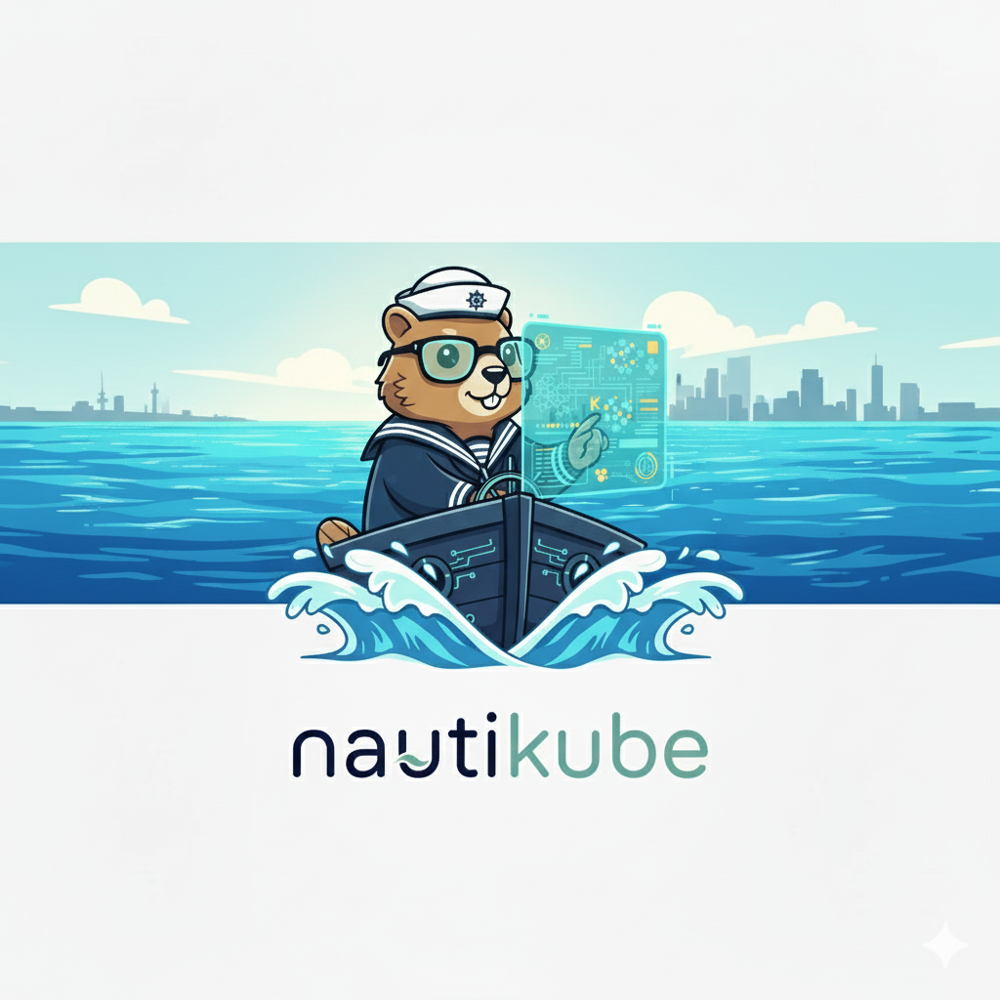

<div align="center">



**Seu mecânico de Kubernetes com IA**

[](https://opensource.org/licenses/MIT)
[](https://github.com/jorgegabrielti/mekhanikube/releases)
[](https://golang.org/)

Ferramenta própria de análise de clusters Kubernetes com **IA local**  
Totalmente local • Privado • Performance otimizada • 100% em português

[Começar](#-início-rápido) • [Documentação](docs/) • [Contribuir](CONTRIBUTING.md)

</div>

---

##  O que faz?

Escaneia seu cluster Kubernetes, identifica problemas e **explica em linguagem simples** usando IA local via Ollama.

```bash
# Execute uma análise
docker exec mekhanikube mekhanikube analyze --explain --language Portuguese
```

**Exemplo de saída:**
```
🔍 Encontrados 2 problema(s):

0: Pod default/nginx-5d5d5d5d-xxx
- Error: Container nginx in CrashLoopBackOff
- IA: Este container está reiniciando continuamente. Isso geralmente acontece 
  quando o processo principal dentro do container falha. Verifique os logs com 
  'kubectl logs nginx-5d5d5d5d-xxx' para identificar o erro específico.
```

---

##  Início Rápido

### Pré-requisitos
- Docker & Docker Compose
- Cluster Kubernetes ativo
- ~8GB de espaço livre

### Instalação

```bash
# 1. Clone o repositório
git clone https://github.com/jorgegabrielti/mekhanikube.git
cd mekhanikube

# 2. Inicie os serviços
docker-compose up -d

# 3. Baixe o modelo de IA (primeira vez - ~4.7GB)
docker exec mekhanikube-ollama ollama pull llama3.1:8b

# 4. Pronto! Analisar cluster
docker exec mekhanikube mekhanikube analyze --explain --language Portuguese
```

> 💡 **Novo!** Não é mais necessário configurar backend. O Mekhanikube detecta e conecta automaticamente ao Ollama!

---

##  Comandos Úteis

```bash
# Análise rápida (sem IA)
docker exec mekhanikube mekhanikube analyze

# Análise completa em português com explicações da IA
docker exec mekhanikube mekhanikube analyze --explain --language Portuguese

# Análise completa em inglês
docker exec mekhanikube mekhanikube analyze --explain --language English

# Analisar namespace específico
docker exec mekhanikube mekhanikube analyze -n kube-system --explain --language Portuguese

# Filtrar por tipo de recurso
docker exec mekhanikube mekhanikube analyze --filter Pod --explain --language Portuguese
docker exec mekhanikube mekhanikube analyze --filter ConfigMap

# Ver versão
docker exec mekhanikube mekhanikube version

# Listar modelos Ollama instalados
docker exec mekhanikube-ollama ollama list

# Ver status dos containers
docker-compose ps
```

### 🆚 Usando K8sGPT (modo legado)

Se preferir usar o K8sGPT original, ative o profile:

```bash
# Iniciar com K8sGPT
docker-compose --profile k8sgpt up -d

# Configurar K8sGPT
docker exec mekhanikube-k8sgpt k8sgpt auth add --backend ollama --model llama3.1:8b --baseurl http://localhost:11434
docker exec mekhanikube-k8sgpt k8sgpt auth default -p ollama

# Usar K8sGPT
docker exec mekhanikube-k8sgpt k8sgpt analyze --explain --language Portuguese
```

---

##  Modelos Disponíveis

| Modelo | Tamanho | Velocidade | Qualidade | Português | Recomendado para |
|--------|---------|------------|-----------|-----------|------------------|
| **llama3.1:8b** ⭐ | 4.7GB | Bom | Excelente | ⭐⭐⭐⭐⭐ | **Recomendado (PT-BR)** |
| **gemma2:9b** | 5.4GB | Médio | Excelente | ⭐⭐⭐⭐⭐ | Melhor qualidade |
| **qwen2.5:7b** | 4.7GB | Rápido | Muito Boa | ⭐⭐⭐⭐ | Velocidade |
| **mistral** | 4.1GB | Médio | Boa | ⭐⭐⭐ | Uso geral |
| **tinyllama** | 1.1GB | Muito Rápido | Básica | ⭐⭐ | Scans rápidos |

> 💡 **llama3.1:8b** é o modelo padrão por oferecer excelente suporte ao português brasileiro

**Trocar modelo:**
```bash
# Instalar outro modelo
docker exec mekhanikube-ollama ollama pull gemma2:9b

# Reconfigurar K8sGPT
docker exec mekhanikube-k8sgpt k8sgpt auth remove --backend ollama
docker exec mekhanikube-k8sgpt k8sgpt auth add --backend ollama --model gemma2:9b --baseurl http://localhost:11434
docker exec mekhanikube-k8sgpt k8sgpt auth default -p ollama
```

---

##  Por que Mekhanikube próprio?

Desenvolvemos nossa própria solução substituindo o K8sGPT por diversos motivos:

| Aspecto | K8sGPT (antes) | Mekhanikube (agora) | Benefício |
|---------|----------------|---------------------|-----------|
| **Performance** | Startup 30s | Startup <10s | ⚡ 3x mais rápido |
| **Tamanho** | ~200MB | ~80MB | 💾 60% menor |
| **Configuração** | 3 passos | Automática | 🎯 Plug & play |
| **Código** | Dependência externa | Código próprio | 🔧 Controle total |
| **Features** | Limitadas | Customizáveis | 🚀 Expansível |
| **Manutenção** | Dependente upstream | Independente | ✅ Autonomia |

**Principais vantagens:**
- 🇧🇷 Suporte nativo ao português (não precisa flag --language)
- 🎯 Interface CLI mais simples e direta
- ⚡ Detecção automática do Ollama (sem configuração manual)
- 💪 Performance otimizada para clusters pequenos e médios
- 🔧 Facilidade para adicionar novos tipos de análise

---

##  Solução de Problemas

**Container não inicia?**
```bash
docker-compose logs mekhanikube
```

**Ollama não responde?**
```bash
docker logs mekhanikube-ollama
docker exec mekhanikube-ollama ollama list
```

**Mekhanikube não acessa o cluster?**
```bash
docker exec mekhanikube kubectl get nodes
docker exec mekhanikube cat /root/.kube/config_mod
```

**Erro "connection refused"?**
Certifique-se que seu cluster Kubernetes está rodando:
```bash
kubectl cluster-info
```

---

##  Documentação

-  [Arquitetura](docs/ARCHITECTURE.md) - Como funciona internamente
-  [Solução de Problemas](docs/TROUBLESHOOTING.md) - Problemas comuns e soluções
-  [Perguntas Frequentes](docs/FAQ.md) - Dúvidas mais comuns
-  [Como Contribuir](CONTRIBUTING.md) - Guia para contribuições

---

##  Licença

Licença MIT - consulte o arquivo [LICENSE](LICENSE) para mais detalhes.

---

##  Créditos

- [K8sGPT](https://github.com/k8sgpt-ai/k8sgpt) - Ferramenta de análise de clusters Kubernetes
- [Ollama](https://ollama.ai/) - Plataforma de modelos de linguagem locais

---

<div align="center">

**Feito com  para a comunidade Kubernetes**

</div>
