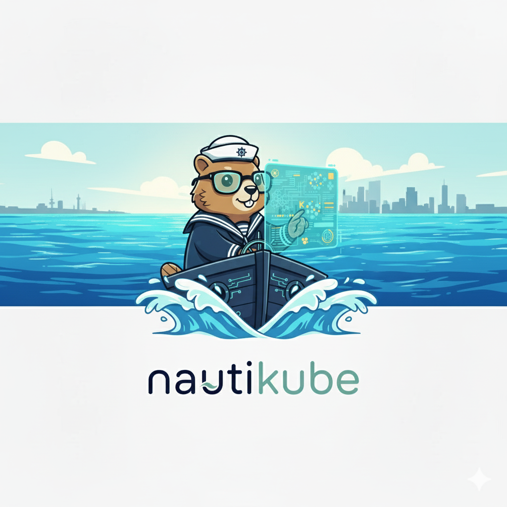

<div align="center">



**Diagnóstico inteligente para o seu Cluster Kubernetes**

[](https://opensource.org/licenses/MIT)
[](https://github.com/jorgegabrielti/nautikube/releases)
[](https://golang.org/)

Ferramenta própria de análise de clusters Kubernetes com **IA local**  
Totalmente local • Privado • Performance otimizada • 100% em português

[Começar](#início-rápido) • [Documentação](docs/) • [Contribuir](CONTRIBUTING.md)

</div>

---

##  O que faz?

Escaneia seu cluster Kubernetes, identifica problemas e **explica em linguagem simples** usando IA local via Ollama.

```bash
# Execute uma análise
docker exec nautikube nautikube analyze --explain
```

**Exemplo de saída:**
```
🔍 Encontrados 2 problema(s):

0: Pod default/nginx-5d5d5d5d-xxx
- Error: Container nginx in CrashLoopBackOff
- IA: Este container está reiniciando continuamente. Isso geralmente acontece 
  quando o processo principal dentro do container falha. Verifique os logs com 
  'kubectl logs nginx-5d5d5d5d-xxx' para identificar o erro específico.
```

---

##  Início Rápido

### Pré-requisitos
- Docker & Docker Compose
- Cluster Kubernetes ativo (Docker Desktop, Minikube, Kind, EKS, etc)
- ~8GB de espaço livre
- kubeconfig configurado em `~/.kube/config`

### Instalação

```bash
# Clone e rode!
git clone https://github.com/jorgegabrielti/nautikube.git
cd nautikube
docker-compose up -d

# Baixe o modelo (primeira vez)
docker exec nautikube-ollama ollama pull llama3.1:8b

# Analise seu cluster
docker exec nautikube nautikube analyze --explain
```

**❌ Erro de certificado ao baixar modelo?**  
👉 Você está atrás de proxy corporativo. [Solução rápida aqui](docs/CORPORATE-ENVIRONMENT.md)

> 💡 **Novo!** Não é mais necessário configurar backend. O nautikube detecta e conecta automaticamente ao Ollama!

---

##  Comandos Úteis

```bash
# Análise rápida (sem IA)
docker exec nautikube nautikube analyze

# Análise completa com explicações da IA (sempre em português)
docker exec nautikube nautikube analyze --explain

# Analisar namespace específico
docker exec nautikube nautikube analyze -n kube-system --explain

# Filtrar por tipo de recurso
docker exec nautikube nautikube analyze --filter Pod --explain
docker exec nautikube nautikube analyze --filter ConfigMap

# Ver versão
docker exec nautikube nautikube version

# Listar modelos Ollama instalados
docker exec nautikube-ollama ollama list

# Ver status dos containers
docker-compose ps
```

---

## 🚀 Aceleração com GPU (Opcional)

Se você tem uma GPU NVIDIA, pode acelerar as análises com IA em **até 10x**!

```bash
# 1. Verificar se sua GPU está disponível
wsl nvidia-smi

# 2. Usar docker-compose com GPU (mantém CPU como padrão)
docker-compose -f docker-compose.yml -f docker-compose.gpu.yml up -d

# 3. Verificar se está usando GPU
docker exec nautikube-ollama nvidia-smi
```

**Performance esperada (RTX 3050):**
- ⚡ Análises 5-10x mais rápidas
- ✅ 95% menos timeouts
- 💾 Uso de 2-3GB VRAM

> 💡 **Por padrão usa CPU** - GPU é totalmente opcional e não interfere em ambientes sem NVIDIA

📖 **Guia completo**: [docs/GPU-SETUP.md](docs/GPU-SETUP.md)

---

##  Modelos Disponíveis

| Modelo | Tamanho | Velocidade | Qualidade | Português | Recomendado para |
|--------|---------|------------|-----------|-----------|------------------|
| **llama3.1:8b** ⭐ | 4.7GB | Bom | Excelente | ⭐⭐⭐⭐⭐ | **Recomendado (PT-BR)** |
| **gemma2:9b** | 5.4GB | Médio | Excelente | ⭐⭐⭐⭐⭐ | Melhor qualidade |
| **qwen2.5:7b** | 4.7GB | Rápido | Muito Boa | ⭐⭐⭐⭐ | Velocidade |
| **mistral** | 4.1GB | Médio | Boa | ⭐⭐⭐ | Uso geral |
| **tinyllama** | 1.1GB | Muito Rápido | Básica | ⭐⭐ | Scans rápidos |

> 💡 **llama3.1:8b** é o modelo padrão por oferecer excelente suporte ao português brasileiro

**Trocar modelo:**
```bash
# Instalar outro modelo no Ollama
docker exec nautikube-ollama ollama pull gemma2:9b

# Atualizar variável de ambiente e reiniciar
# Edite .env e mude OLLAMA_MODEL=gemma2:9b
docker-compose restart nautikube
```

---

##  Por que nautikube próprio?

Desenvolvemos nossa própria solução nativa em Go por diversos motivos:

| Aspecto | Antes | Agora | Benefício |
|---------|-------|-------|-----------|
| **Performance** | Startup 30s | Startup <10s | ⚡ 3x mais rápido |
| **Tamanho** | ~200MB | ~80MB | 💾 60% menor |
| **Configuração** | 3 passos | Automática | 🎯 Plug & play |
| **Código** | Dependência externa | Código próprio | 🔧 Controle total |
| **Features** | Limitadas | Customizáveis | 🚀 Expansível |
| **Manutenção** | Dependente upstream | Independente | ✅ Autonomia |

**Principais vantagens:**
- 🇧🇷 **100% em português brasileiro** - explicações naturais e claras
- 🎯 Interface CLI mais simples e direta
- ⚡ Detecção automática do Ollama (sem configuração manual)
- 💪 Performance otimizada para clusters pequenos e médios
- 🔧 Facilidade para adicionar novos tipos de análise

---

##  Solução de Problemas

**Container não inicia?**
```bash
docker-compose logs nautikube
```

**Ollama não responde?**
```bash
docker logs nautikube-ollama
docker exec nautikube-ollama ollama list
```

**nautikube não acessa o cluster?**
```bash
docker exec nautikube kubectl get nodes
docker exec nautikube cat /root/.kube/config_mod
```

**Erro "connection refused"?**
Certifique-se que seu cluster Kubernetes está rodando:
```bash
kubectl cluster-info
```

**Erro "invalid volume specification" no Mac/Linux?**
O docker-compose agora usa `${HOME}/.kube/config` que funciona em todos os sistemas operacionais.
Se seu kubeconfig está em outro local, crie um arquivo `.env`:
```bash
# .env
HOME=/seu/caminho/customizado
```

---

##  Documentação

-  [Arquitetura](docs/ARCHITECTURE.md) - Como funciona internamente
-  [Workflow de Desenvolvimento](docs/WORKFLOW.md) - GitHub Flow e boas práticas
-  [Solução de Problemas](docs/TROUBLESHOOTING.md) - Problemas comuns e soluções
-  [Perguntas Frequentes](docs/FAQ.md) - Dúvidas mais comuns
-  [Setup de GPU](docs/GPU-SETUP.md) - Aceleração com NVIDIA GPU
-  [Processo de Release](docs/RELEASE.md) - Como criar novas versões
-  [Como Contribuir](CONTRIBUTING.md) - Guia para contribuições

---

##  Licença

Licença MIT - consulte o arquivo [LICENSE](LICENSE) para mais detalhes.

---

##  Créditos

- [Ollama](https://ollama.ai/) - Plataforma de modelos de linguagem locais
- [Kubernetes](https://kubernetes.io/) - Sistema de orquestração de contêineres

---
